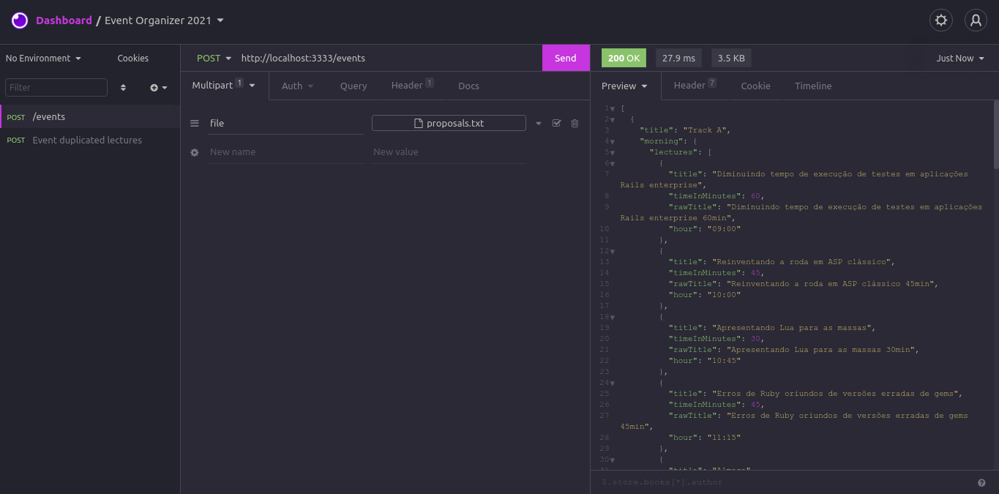

# 📅 Event Organizer 2021

## 📝 Description
Event Organizer 2021 is a Node.js REST API that converts a file with lectures and the time of each into an organized JSON with all tracks, sessions and hours.

It uses:
- The Knapsack algorithm to organize the event and get the best combination between the lectures
- Concepts of Clean Architecture.

### Endpoints
The application have only one endpoint __('/events' - POST Method)__, which gets a .txt file as input (multipart/form-data) and returns a JSON by output.

## 🔗 Project dependencies
- Express (To create the server)
- Multer (To upload the .txt file)
- Sucrase (Transform newer JS syntax to older)
- Jest and Supertest (To implement tests)
- Nodemon (Run server in development mode without need to restart for every change)

## 🚀 Run on your machine

Note: it requires yarn or npm installed 

> Initial steps
```bash
$ git clone https://github.com/ruifernandees/event-organizer-2021.git
$ cd event-organizer
# Install all dependencies
$ yarn install
```

> Run server (development mode)
```bash

# Start the server
$ yarn dev

```

> Prepare the files for the production environment
```bash

# Start the server
$ yarn build

```

> Run server (production environment)
```bash

# Start the server
$ yarn start

```

> Run tests
```bash

# Start the server
$ yarn test

```

## Locations of the tests
- Integration tests: (/\__test__\)
- ConvertRawLectures tests: (/src/useCases/ConvertRawLectures/\__test__\)
- OrganizeEventUseCase tests: (/src/useCases/OrganizeEventUseCase\__test__\)
- Organizer tests: (/src/entities/Organizer/\__test__\)

## 💻 Demonstration


### Input example

```txt
Diminuindo tempo de execução de testes em aplicações Rails enterprise 60min
Reinventando a roda em ASP clássico 45min
Apresentando Lua para as massas 30min
Erros de Ruby oriundos de versões erradas de gems 45min
Erros comuns em Ruby 45min
Rails para usuários de Django lightning
Trabalho remoto: prós e cons 60min
Desenvolvimento orientado a gambiarras 45min
Aplicações isomórficas: o futuro (que talvez nunca chegaremos) 30min
Codifique menos, Escreva mais! 30min
Programação em par 45min
A mágica do Rails: como ser mais produtivo 60min
Ruby on Rails: Por que devemos deixá-lo para trás 60min
Clojure engoliu Scala: migrando minha aplicação 45min
Ensinando programação nas grotas de Maceió 30min
Ruby vs. Clojure para desenvolvimento backend 30min
Manutenção de aplicações legadas em Ruby on Rails 60min
Um mundo sem StackOverflow 30min
Otimizando CSS em aplicações Rails 30min
```

### Output
```json
[
  {
    "title": "Track A",
    "morning": {
      "lectures": [
        {
          "title": "Diminuindo tempo de execução de testes em aplicações Rails enterprise",
          "timeInMinutes": 60,
          "rawTitle": "Diminuindo tempo de execução de testes em aplicações Rails enterprise 60min",
          "hour": "09:00"
        },
        {
          "title": "Reinventando a roda em ASP clássico",
          "timeInMinutes": 45,
          "rawTitle": "Reinventando a roda em ASP clássico 45min",
          "hour": "10:00"
        },
        {
          "title": "Apresentando Lua para as massas",
          "timeInMinutes": 30,
          "rawTitle": "Apresentando Lua para as massas 30min",
          "hour": "10:45"
        },
        {
          "title": "Erros de Ruby oriundos de versões erradas de gems",
          "timeInMinutes": 45,
          "rawTitle": "Erros de Ruby oriundos de versões erradas de gems 45min",
          "hour": "11:15"
        },
        {
          "title": "Almoço",
          "timeInMinutes": 0,
          "rawTitle": "Almoço",
          "hour": "12:00"
        }
      ],
      "timeOfLectures": 180
    },
    "afternoon": {
      "lectures": [
        {
          "title": "Erros comuns em Ruby",
          "timeInMinutes": 45,
          "rawTitle": "Erros comuns em Ruby 45min",
          "hour": "13:00"
        },
        {
          "title": "Trabalho remoto: prós e cons",
          "timeInMinutes": 60,
          "rawTitle": "Trabalho remoto: prós e cons 60min",
          "hour": "13:45"
        },
        {
          "title": "Desenvolvimento orientado a gambiarras",
          "timeInMinutes": 45,
          "rawTitle": "Desenvolvimento orientado a gambiarras 45min",
          "hour": "14:45"
        },
        {
          "title": "Aplicações isomórficas: o futuro (que talvez nunca chegaremos)",
          "timeInMinutes": 30,
          "rawTitle": "Aplicações isomórficas: o futuro (que talvez nunca chegaremos) 30min",
          "hour": "15:30"
        },
        {
          "title": "Codifique menos, Escreva mais!",
          "timeInMinutes": 30,
          "rawTitle": "Codifique menos, Escreva mais! 30min",
          "hour": "16:00"
        },
        {
          "title": "Ensinando programação nas grotas de Maceió",
          "timeInMinutes": 30,
          "rawTitle": "Ensinando programação nas grotas de Maceió 30min",
          "hour": "16:30"
        },
        {
          "title": "Evento de Networking",
          "timeInMinutes": 0,
          "rawTitle": "Evento de Networking",
          "hour": "17:00"
        }
      ],
      "timeOfLectures": 240
    },
    "startMorningHour": 540,
    "endMorningHour": 720,
    "startAfternoonHour": 780,
    "endAfternoonHour": 1020
  },
  {
    "title": "Track B",
    "morning": {
      "lectures": [
        {
          "title": "Programação em par",
          "timeInMinutes": 45,
          "rawTitle": "Programação em par 45min",
          "hour": "09:00"
        },
        {
          "title": "A mágica do Rails: como ser mais produtivo",
          "timeInMinutes": 60,
          "rawTitle": "A mágica do Rails: como ser mais produtivo 60min",
          "hour": "09:45"
        },
        {
          "title": "Clojure engoliu Scala: migrando minha aplicação",
          "timeInMinutes": 45,
          "rawTitle": "Clojure engoliu Scala: migrando minha aplicação 45min",
          "hour": "10:45"
        },
        {
          "title": "Ruby vs. Clojure para desenvolvimento backend",
          "timeInMinutes": 30,
          "rawTitle": "Ruby vs. Clojure para desenvolvimento backend 30min",
          "hour": "11:30"
        },
        {
          "title": "Almoço",
          "timeInMinutes": 0,
          "rawTitle": "Almoço",
          "hour": "12:00"
        }
      ],
      "timeOfLectures": 180
    },
    "afternoon": {
      "lectures": [
        {
          "title": "Rails para usuários de Django",
          "timeInMinutes": 5,
          "rawTitle": "Rails para usuários de Django lightning",
          "hour": "13:00"
        },
        {
          "title": "Ruby on Rails: Por que devemos deixá-lo para trás",
          "timeInMinutes": 60,
          "rawTitle": "Ruby on Rails: Por que devemos deixá-lo para trás 60min",
          "hour": "13:05"
        },
        {
          "title": "Manutenção de aplicações legadas em Ruby on Rails",
          "timeInMinutes": 60,
          "rawTitle": "Manutenção de aplicações legadas em Ruby on Rails 60min",
          "hour": "14:05"
        },
        {
          "title": "Um mundo sem StackOverflow",
          "timeInMinutes": 30,
          "rawTitle": "Um mundo sem StackOverflow 30min",
          "hour": "15:05"
        },
        {
          "title": "Otimizando CSS em aplicações Rails",
          "timeInMinutes": 30,
          "rawTitle": "Otimizando CSS em aplicações Rails 30min",
          "hour": "15:35"
        },
        {
          "title": "Evento de Networking",
          "timeInMinutes": 0,
          "rawTitle": "Evento de Networking",
          "hour": "16:05"
        }
      ],
      "timeOfLectures": 185
    },
    "startMorningHour": 540,
    "endMorningHour": 720,
    "startAfternoonHour": 780,
    "endAfternoonHour": 1020
  }
]
```